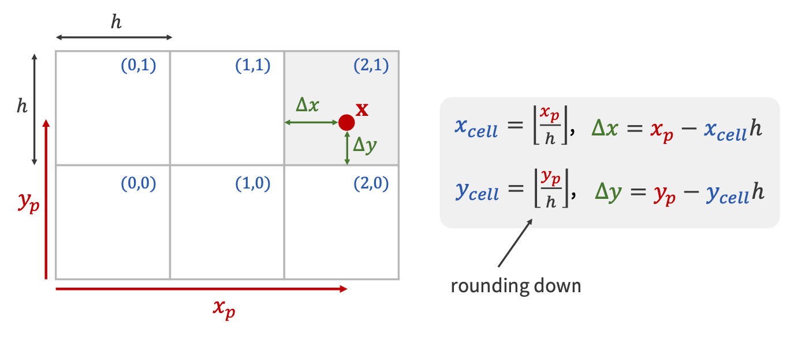
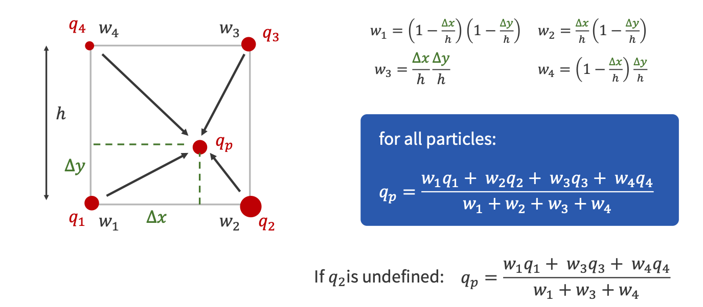
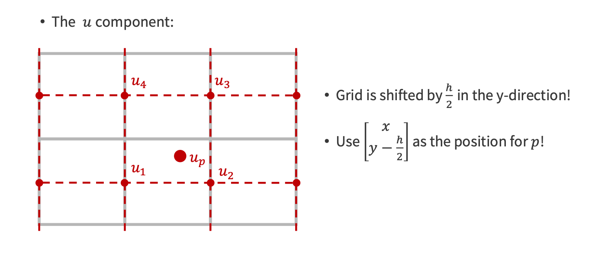
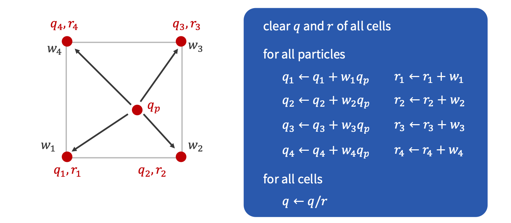
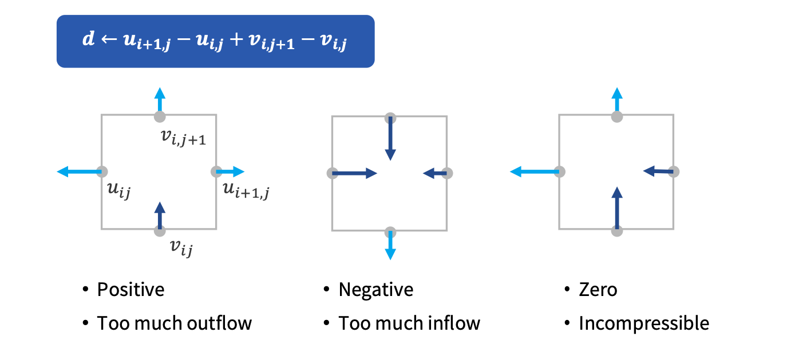
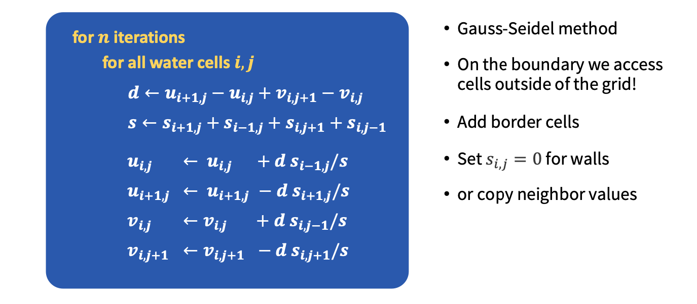

# Jalashaya PIC/FLIP Simulation

# PIC/FLIP Fluid Simulation

PIC/FLIP, which stands for Particle-in-Cell/Fluid-Implicit-Particle is a popular particle-based simulation technique for fluids. Originally proposed in 2005, this method alleviates the problem of lacking surface detail faced by level-set based methods and the issues of excessive velocity smoothing faced by regular PIC, which was proposed as early as the 1960s. This page covers the  implementation of PIC/FLIP in a concise manner.

## Simulation Pipeline

As a whole, PIC/FLIP simulation consists of the following stages:

1. Transferring particle velocities to a grid (splatting)
2. Using the grid to enforce incompressibility (projection)
3. Transferring the updated grid velocities to the particles (reverse splatting)
4. Moving the particles around in space, based on their updated velocities
5. Post-processing: motion blur, surface reconstruction etc. (BONUS)

As a result, we will follow this pipeline almost exactly in sequential order.

## Setting Up Scenes

Initially, we deal with the setup of our grid - an implicit geometry that we define simply to perform pressure solves on. This grid has a certain `LENGTH`, `WIDTH`, and `HEIGHT`. Moreover, we define a fixed `SPACING` parameter, which dictates the distance (in whatever units) between two grid cells. In the implementation, these values are fixed in such a way as to run the simulation on a 128x64x64 grid, keeping grid spacing to 10.0 units.

Once this is done, we move on to the particles. A particle radius factor is implemented, which defines the proportion of a single grid cell that the particle radius occupies. This is adjusted to ensure that on average, 8 particles can occupy a single grid cell (i.e. each particle has a radius of ~0.25 the grid cell length).

## Transferring Particle Velocities to the Grid

In the initial state, all particles are simply suspended in air, and at rest. Such a velocity field has zero divergence, and thus we are able to perform advection on it safely. However, for subsequent time-steps, projection needs to be performed in order to enforce incompressibility. The only way to perform projection, however, is using a representation for the entire velocity field of our simulation. This involves using a grid, while the simulation itself only stores particles (velocities and positions are thus also stored on particles). Hence, we perform a transfer of velocity values from particles onto the grid. This is known as splatting. This is performed by considering the neighboring velocity components on the grid for each particle, in an approach called ‘shooting’. However, this can also be done with another strategy, called ‘gathering’ - instead of iterating over particles and splatting values via interpolation, we can iterate over grid cells, and collect velocity data from nearby particles, again using interpolation. The second approach provides a noticeable speed improvement by way of parallel computing without the risk of a race condition, but the first one is simpler to implement (this is what has been done in Jalashaya).

The interpolation weight computations for copying particle velocities over to grid nodes. 

The weight values themselves. Also provided are the closed form computations of particle quantity values - this is later used when transferring corrected grid velocities back to the particles.

An implementation concern, where the grid cells must be offset by half the cell length to ensure that interpolation weights are correctly computed. 

The final algorithm used for copying particle quantity values over to grid cells.

## Enforcing Incompressibility

Now that we’ve seen how particle velocity values are transferred over to the grid, it’s time to make the magic happen! The grid is only needed to enforce incompressibility, after all. In essence, what we need is to make sure that the divergence of the velocity field is zero, i.e. there are no sources or sinks of velocity flow and no mass is being compressed. 

A recap of what divergence represents in the discrete case of our grid.

Once the divergence has been computed, we need to solve for the pressure for each grid cell. This can be done in several ways, such as the Preconditioned Conjugate Gradient method, which can be parallelized by using BLAS operations (nice!) or the iterative Gauss-Seidel method (with over-relaxation, of course) which can often be faster for quick approximations and small-scale simulations. In Jalashaya, Gauss-Seidel is used for simplicity, but porting over to PCG (potentially with MIC(0) optimizations on top!) is on the list for future improvements.  

A pseudocode summary of the Gauss-Seidel method for performing pressure projection. This variant of the algorithm also accounts for solid cells/walls through the use of the s term.

## Transferring Grid Velocities Back to Particles

Now that we’ve managed to ensure a divergence-free velocity field, it’s time to copy these velocities back to our particles! This, similar to the splatting procedure, can be done in both the shooting and gathering styles - Jalashaya uses shooting again this time, which may seem like a bummer, but no! Unlike splatting, where shooting could encounter race conditions when parallelized, in this case, gathering has that issue, and iterating over particles can be easily parallelized.

The content with regards to how the transfer is performed is exactly what was discussed in the section on splatting. However, what’s important to note (and really is what makes PIC/FLIP so good) is the way particle velocities are updated. To enhance this discussion, a background review must first be done.

### PIC

As per PIC, the interpolated particle velocity sampled from the grid is directly copied over to the particle itself. Owing to the use of bi/trilinear interpolation in Jalashaya (although even higher-order interpolation methods face the same fundamental limitation), there is a significant amount of smoothing of particle velocities over time, leading to a visible viscosity of some sort in the simulation. As a result, when pure PIC is used, fluids appear quite thick and viscous.

### FLIP

The FLIP method alleviated this smoothing issue for PIC. Instead of using the updated particle velocities as a full-on replacement for old velocities, FLIP only ****adds**** the changes in the velocities to the particles’ velocities. This means that any smoothing that does occur is not accumulated over time since smoothed values don’t completely replace old values, making FLIP almost completely energy dissipation-free.

Now, the obvious but not-so-obvious solution for PIC/FLIP is - to combine the PIC and FLIP updates as an affine combination! In this way, we can manually tweak how viscous we want our fluids to appear, so that’s how the particle velocities are determined from the updated grid values.

## Advection

The only piece of Jalashaya’s simulation pipeline that we haven’t talked about so far, then, is the advection procedure. This is done in two ways, which can be toggled between. The first is a Symplectic Euler time integrator, which is quite simple, but can be super unstable for large time-steps. The second is RK3, a variant that is only first-order accurate but handles details in regions of rotation much better.